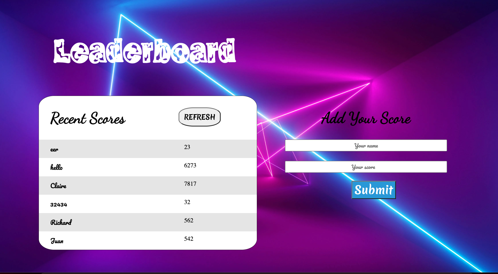

# Leaderboard Project 

> The project consumes apis to add and dispalau users.

## Built With
- Major Languages: JAVASCRIPT, HTML, CSS
- Major Technologies : Git, Github, Gitflow

### Prerequisites
- npm ( Node Package Manager )
- git and Github Account

### Setup
To get a local copy up and running follow these simple example steps.
- Open terminal
- Change the directory you want put the repo
- Then run
  i. git clone git@github.com:richardoppiyo/To_do_list_webpack.git
  ii. cd repo-name/

### Install linters
- **Webhint** linter

  `npm install --save-dev hint@6.x`

- **Stylelint** linter

  `npm install --save-dev stylelint@13.x stylelint-scss@3.x stylelint-config-standard@21.x stylelint-csstree-validator@1.x`

- **ESLint** linter

  `npm install --save-dev eslint@7.x eslint-config-airbnb-base@14.x eslint-plugin-import@2.x babel-eslint@10.x`

### Run linters
- **Webhint** 
linter -`npx hint .` on the root of your directory of your project.

- **Stylelint** 
linter - `npx stylelint "**/*.{css,scss}"` on the root of your directory of your project.

- **ESLint** linter
  - `npx eslint .` on the root of your directory of your project.

### Run project
- Now run the following:
 `npm install`  - on the root directory of the project to install the required packages
 `npm start`   - on the root directory of the project to start the project 

### API Information
The leaderboard API is accessed using the following base url:
https://us-central1-js-capstone-backend.cloudfunctions.net/api/

**Endpoints**
1. /games/
- Make a POST request with the following parameters to create a game:
  { 
  "name": "Name of the game" 
}

2. /games/:id/scores/
-Make a POST to create a new score for the given game
The parameters for POST are as follows:
  { 
  "user": "John Doe",
  "score": 42
 }

-Make a GET to get a list of scores for the given game

## Authors

👤 **Author1**

- GitHub: [@richardoppiyo](https://github.com/richardoppiyo)
- Twitter: [@blessed_ricky](https://twitter.com/blessed_ricky)
- LinkedIn: [Richard Opiyo](https://linkedin.com/in/richardoppiyo)

## Show your support

Give a ⭐️ if you like this project!

## Acknowledgments

- To morning session team,reviewers and standup team memebers.

## 📝 License

This project is [MIT](./MIT.md) licensed.